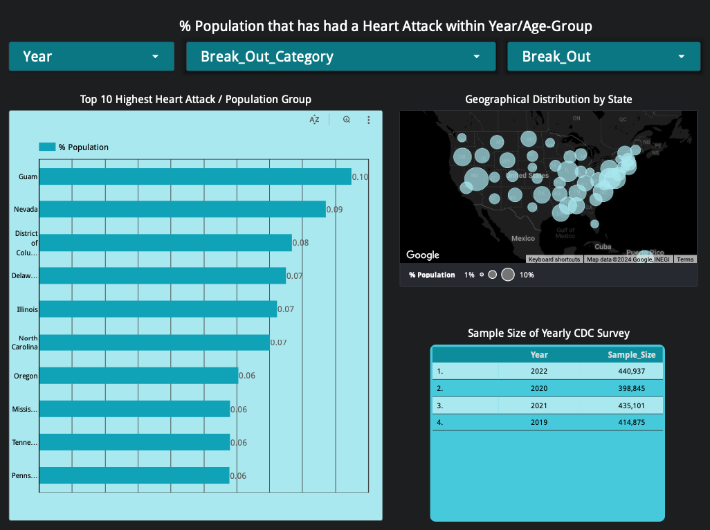

# Project, DE ZoomCamp 2024: U.S. Population Cardiovascular Health Analysis by Location, Population Category (Age, Sex, Education, Income), & Time

This is my capstone project for the [DataTalks.Club](https://datatalks.club) [Data Engineering Zoomcamp](https://github.com/DataTalksClub/data-engineering-zoomcamp) 2024 Cohort.
 
## Problem Statement
It's a common to think that the health of the general U.S. population has been in decline over the past two decades. Common health news such as the double digit increase in adult obesity rates would make one thing that cardiovascular health is also on the decline.
In actuality, there has been a slight decline in the rate of deaths due to cardiovascular disease (CVD). In 2009, there were 182.8 deaths/100,000 due to heart disease. In 2019, this came down to 161.5 deaths/100,000.

This project aims to explore the data and patterns behind the population's cardiovascular health changes over the past few years and to update itself on a yearly basis for continual monitoring. This can answer several questions:
* Are there specific locations (states) that are more heavily impacted by CVD? And where there has been an increase or decrease in CVD rates?
* Has there been a change in the population age where CVD is prevalent?
* Has CVD rates changed on a socioeconomic group basis (Income, Education, or Ethnicity)?

### Dataset
 The data comes from the CDC's available data on 'Behavorial Risk Factors.' This data is from a continuous, state-based surveillance system for chronic diseases inclusive of cardiovascular health.
 https://data.cdc.gov/Behavioral-Risk-Factors/BRFSS-Graph-of-Current-Prevalence-of-Cardiovascula/gfhd-2f5y

 Collection and quality assurance methodology can be reviewed here: https://github.com/DataTalksClub/data-engineering-zoomcamp

 This dataset can be downloaded on a yearly basis into a .csv file. This application will Batch process on a yearly basis for demonstration, but can also be done on a daily, weekly, or monthly basis.

## Data Pipeline Architecture

### Technology Stack
* Infrastructure as Code (IaC): Terraform
* Workflow Orchestration: Google Cloud Dataproc
* Data Lake: Google Cloud Storage (GCS)
* Data Warehouse: Google Cloud BigQuery
* Batch Processing: Python, Pandas
* Transformations: Spark
* Visualization: Google Looker Studio

### Orchestration

### Data Ingestion to Google Cloud Storage
The download_to_gcs.py script will kick off to download yearly CDC data to a Good Cloud Storage bucket. The file will be converted to a parquet amended to give a unique identifier for each row. This is because each row in this dataset corresponds to a survey of a specific state and specific population grouping for each survey question. So a unique identifier can be with the format:[Year]-[Location]-[QuestionID]-[ResponseID]-[BreakOutCategoryID]-[BreakOutID]. For example:[2021]-[California]-[QCVDINFR4]-[RESP046]-[CAT3]-[AGE01].

### Data Cleaned, Partitioned, Clustered, Joined/Trasbsformed and Written to BigQuery
The process_to_bigquery.py script uses Spark to access BigQuery and Google Cloud Storaget perform the following actions and create new tables from the bucket data:

Step 1. Create a new dataframe without redundant columns by reading from the GCS bucket. Create another dataframe by reading the existing BigQuery output table. These dataframes are joined in order to add a new set of data for each year of CDC data.

For the final dataset, these columns used in downstream processing, queries, and visualization:
- Key
- Year
- Locationdesc
- QuestionID
- Response
- Break_Out
- Break_Out_Category
- Sample_Size
- Data_value

These removed columns are redundant or unused in downstream steps:
- Display_order
- Data_value_unit
- Data_value_type
- Data_Value_Footnote_Symbol
- Data_Value_Footnote
- DataSource
- BreakOutID
- BreakOutCategoryID
- LocationID
- Data_Value_Footnote_Symbol
- Data_Value_Footnote
- Confidence_limit_Low
- Confidence_limit_High
- Class
- Topic
- Question
- ResponseID
- Geolocation

Step 2. The script partitions and clusters the dataset based on the Break_Out_Category which is equivalent to the description of the population group. Because downstream queries and visualizations would be from within each Break_Out_Category, it makes sense to cluster them this way for faster queries.
* Age Group
* Education Attained
* Gender
* Household Income
* Race/Ethnicity
* Overall

Note: The dataset can also be clustered by QuestionID if the downstream queries/visualizations were based on the questions asked instead of the population group type.
* Question1: "Ever told you had a heart attack (myocardial infarction)?"
* Question 2: "Ever told you had a stroke?"
* Question 3: "Ever told you had angina or coronary heart disease?"
* Question 4: "Respondents that have ever reported having coronary heart disease (chd) or myocardial infarction (mi) (variable calculated from one or more BRFSS questions)"

Step 4. TThe updated table is saved into BigQuery.

### Dashboard
The dashboard is made addressing only one Survey Question to demo the application. The dashboard could easily be copied and adjusted to query each Survey Question.

The dashboard shows 3 tiles that are controlled by Year, Population Category Type, and Population Category: Top 10 States Experiencing CVD Bar Chart, Geographical Distribution by State Bubble Map, and a Scoreboard showing the Sample_Size of each survey year. The Sample_Size is important to ensure data quality adaquetly represents the actual population.

## Running the project
TBD instructions
