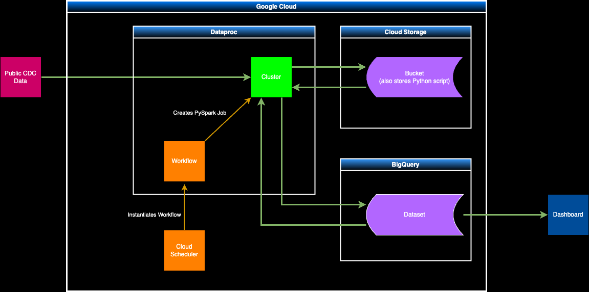

# Project, DE ZoomCamp 2024: U.S. Population Cardiovascular Health Analysis by Location, Population Category (Age, Sex, Education, Income), & Time

This is my capstone project for the [DataTalks.Club](https://datatalks.club) [Data Engineering Zoomcamp](https://github.com/DataTalksClub/data-engineering-zoomcamp) 2024 Cohort.
 
## Problem Statement
It's a common to think that the health of the general U.S. population has been in decline over the past two decades. Common health news such as the double digit increase in adult obesity rates would make one thing that cardiovascular health is also on the decline.
In actuality, there has been a slight decline in the rate of deaths due to cardiovascular disease (CVD). In 2009, there were 182.8 deaths/100,000 due to heart disease. In 2019, this came down to 161.5 deaths/100,000.

This project aims to explore the data and patterns behind the population's cardiovascular health changes over the past few years and to update itself on a yearly basis for continual monitoring. This can answer several questions among many more:
* Are there specific locations (states) that are more heavily impacted by CVD? And where there has been an increase or decrease in CVD rates?
* Has there been a change in the population age where CVD is prevalent?
* Has CVD rates changed on a socioeconomic group basis (Income, Education, or Ethnicity)?

### Dataset
The data comes from the CDC's available data on 'Behavorial Risk Factors.' This data is from a continuous, state-based surveillance system for chronic diseases inclusive of cardiovascular health.
Available [here](https://data.cdc.gov/Behavioral-Risk-Factors/BRFSS-Graph-of-Current-Prevalence-of-Cardiovascula/gfhd-2f5y).

This dataset can be downloaded on a yearly basis into a .csv file. This application will Batch process on a yearly basis for a cost and time efficient demonstration, but can easily be adjusted to run on a daily, weekly, or monthly basis. Instructions are also provided to Force the workflow process to run for demonstration purposes.

## Data Pipeline Architecture

Architecture Diagram:

### Technology Stack
* Infrastructure as Code (IaC): Terraform
* Workflow Orchestration: Google Cloud Scheduler
* Data Lake: Google Cloud Storage (GCS)
* Data Warehouse: Google Cloud BigQuery
* Batch Processing: Python, Pandas, Google Cloud Dataproc
* Transformations: PySpark
* Visualization: Google Looker Studio

### Orchestration
Orchestration is done using Google Cloud services. Cloud Scheduler performs the orchestration timing to instatiate a Dataproc Workflow Template that establishes a cluster and runs the processing job. A python script defines the entire workflow pipeline that can be categorized as an Extraction portion and as a Transform/Loading portion. The mechanisms in the python script are described below.

The Transform/Loading portion of the script utilizes spark to read, clean, and join the data to an output table in BigQuery. The script also checks to make sure the output table exists else otherwise creates it.

### Data Ingestion to Google Cloud Storage
The Extraction portion of the script will kick off to download yearly CDC data to a Good Cloud Storage bucket. The file will be converted to a parquet amended to give a unique identifier for each row. This is because each row in this dataset corresponds to a survey of a specific state and specific population grouping for each survey question. So a unique identifier can be with the format:[Year]-[Location]-[QuestionID]-[ResponseID]-[BreakOutCategoryID]-[BreakOutID]. For example:[2021]-[California]-[QCVDINFR4]-[RESP046]-[CAT3]-[AGE01].
Additionally, the script also checks that the data bucket initially exists and creates it if not to prevent upload errors.

### Data Cleaning, Transforming, Partitioning/Clustering, and Writing to BigQuery
The process_to_bigquery.py script utilizes Spark to access BigQuery and Google Cloud Storage and to create/update an output table that will be the datasource for a Looker Studio dashboard.

Step 1. Create a new dataframe without redundant columns by reading from the GCS bucket. Create another dataframe by reading the existing BigQuery output table.

For the final dataset, these columns used in downstream processing, queries, and visualization. The dataframe will only contain hese columns.
- Key
- Year
- Locationdesc
- QuestionID
- Response
- Break_Out
- Break_Out_Category
- Sample_Size
- Data_value

These removed columns are redundant or unused in downstream steps:
- Display_order
- Data_value_unit
- Data_value_type
- Data_Value_Footnote_Symbol
- Data_Value_Footnote
- DataSource
- BreakOutID
- BreakOutCategoryID
- LocationID
- Data_Value_Footnote_Symbol
- Data_Value_Footnote
- Confidence_limit_Low
- Confidence_limit_High
- Class
- Topic
- Question
- ResponseID
- Geolocation

Step 2. The script performs several transformations. 1) removes rows where there are any NULL values in a relavent column. 2) Replaces "Georgia" and "Maryland" with "Georgia USA" and "Maryland USA" for correct dashboard geomapping. 3) It then outer joins the spark dataframe of new yearly data with the spark dataframe made from existing BigQuery output table. 

Step 3. The script partitions and clusters the dataset based on the Break_Out_Category which is equivalent to the description of the population group. Because downstream queries and visualizations would be from within each Break_Out_Category, it makes sense to cluster them this way for faster queries.
* Age Group
* Education Attained
* Gender
* Household Income
* Race/Ethnicity
* Overall

Note: The dataset can also be clustered by QuestionID if the downstream queries/visualizations were based on the questions asked instead of the population group type.
* Question1: "Ever told you had a heart attack (myocardial infarction)?"
* Question 2: "Ever told you had a stroke?"
* Question 3: "Ever told you had angina or coronary heart disease?"
* Question 4: "Respondents that have ever reported having coronary heart disease (chd) or myocardial infarction (mi) (variable calculated from one or more BRFSS questions)"

Step 4. The updated table is saved into the BigQuery output table that is referenced by the dashboard.

### Dashboard
The dashboard is made addressing only one Survey Question to demo the application. The dashboard could easily be copied and adjusted to query each Survey Question.

The dashboard shows 3 tiles that are controlled by Year, Population Category Type, and Population Category: Top 10 States Experiencing CVD Bar Chart, Geographical Distribution by State Bubble Map, and a Scoreboard showing the Sample_Size of each survey year. The Sample_Size is important to ensure data quality adaquetly represents the actual population.

Click [here](https://lookerstudio.google.com/reporting/3d13925d-18a0-4c6a-be4b-a775bdf1d42f) for the current running public dashboard. Note: If it is broken, then my free Google Cloud account may have expired. If that is the case, please review these previews below to understand the dashboard.

  
  
  
  
  

## Files
├── etl  
│&emsp;   ├── full_workflow_gcs_bq_etl.py                         &emsp;&emsp;&emsp;&emsp;&emsp;&emsp;Main python file performing all workflow pipeline steps  
├── keys  
│&emsp;   └── (Placeholder for credentials.json)                  &emsp;&emsp;&emsp;&emsp;Convinient location to place your .json key for personal deployment  
├── lib  
│&emsp;   ├── gcs-connector-hadoop3-2.2.5.jar                     &emsp;&emsp;&emsp;&emsp;&emsp;&emsp;&emsp;&emsp;&emsp;&emsp;&emsp;&emsp;Only used if running local spark instance  
│&emsp;   ├── spark-bigquery-with-dependencies_2.12-0.37.0.jar    &emsp;&emsp;&emsp;&emsp;&emsp;Only used if running local spark instance  
│&emsp;   └── init_dataproc_modules.sh                            &emsp;&emsp;&emsp;&emsp;&emsp;&emsp;&emsp;&emsp;&emsp;&emsp;&emsp;&emsp;&emsp;&emsp;&emsp;Executable used in cluster initialization to provide python modules needed  
└── terraform  
&emsp;    ├── main.tf                                             &emsp;&emsp;&emsp;&emsp;&emsp;&emsp;&emsp;&emsp;&emsp;&emsp;&emsp;&emsp;&emsp;&emsp;&emsp;&emsp;&emsp;Main terraform file  
&emsp;    └── variables.tf                                        &emsp;&emsp;&emsp;&emsp;&emsp;&emsp;&emsp;&emsp;&emsp;&emsp;&emsp;&emsp;&emsp;&emsp;&emsp;Supporting file to set variables used by main.tf

## Deployment, Running the project on your own
This project relies on Google Cloud and Terraform for deployment.

1. Clone this repo.
2. Ensure you have a Google Cloud account.
3. Create a new project. 
4. Create a Service Account with an exported Key in a .json format. This is the exact same as the course instructions on setting up Terraform and Google Cloud.
    - Under Google IAM, provide the following roles to the Service Account: BigQuery Admin, BigQuery Connection Admin, Cloud Service Agent, Cloud Scheduler Admin, Compute Admin, Compute Engine Service Agent, Dataproc Administrator, Dataproc Service Agent, Dataproc Worker, IAM OAuth Client Admin, Service Account User, Storage Admin.
        -Note: For this project demonstration, custom roles were not made so existig roles were used.
    - Note the location of where you end up placing the Key file. This will be used in the Terraform variables file.
5. Ensure you have Terraform installed. Follow the class video on Terraform if not.
6. Update the Terraform/variables.tf file for the following:
    - Service Account credentials location (credentials)
    - Service Account Name (service_account_id)
    - Project ID (project)
    - Project Location (location)
    - Region (region)
        - Note that Cloud Schedular is not available in all regions. Run 'gcloud scheduler locations list' to check.
    - dataproc region (dp_region)
    - GCS Bucket Name (gcs_bucket_name)
7. Update the following variables in the etl/full_workflow_gcs_bq_etl.py file to match your Terraform variables:
    - projectID
    - bucketName
8. Start and apply Terraform
    -run 'terraform init' from the terminal
    -run 'terraform plan' for good measure
    -run 'terraform apply'
    -When done, run 'terraform destroy' to save resources
    -Note: You may need to run these commands from the terraform directory in this project
9. At this point, your Google Cloud project will start with a Dataproc job to process CDC data from 2019. You can view the job running in your Google Cloud console web GUI under Dataproc Clusters.
    - I have prepared two additional "Data Filling" Workflow Templates (See under console Dataproc/Workflows/Workflow Templates) that can be instantiated to run the workflow and fill in data from 2020 and 2021. This is optional to run since the project works whether or not it has data from every year.
        - Note: Attempting to run more than one job at a time may run an error with processing quota on your Google Cloud account. For example, if you try to run both of these Data Filling jobs at the same time.
    - There is also a template workflow that can be used to fill in data from 2 years ago. This was written this way because 2023 and 2024 do not have much data yet. So it's as if we're pretending the current year is 2022 for demonstrations sake. There is no need to instantiate this template workflow because it will be kicked off by Cloud Scheduler.
        -Instead of waiting for the Scheduler to start the job, you may go into the UI to force the job to start. Go to Google Cloud Scheduler in the console and there will be a 'cdc-pull-schedule' job. Under Actions, click 'Force Run'.
10. Preparing a dashboard based off your BigQuery dataset. Open the dashboard from [here](https://lookerstudio.google.com/reporting/ae5bba68-1d5f-4a30-a5e1-f2b41f90921f).
    - Open this [template dashboard](https://lookerstudio.google.com/reporting/d465d4bf-5221-42d1-99d5-4940336c347d) for the dashboard template.
    - Go to Resource --> Manage added data sources --> Edit bq_output_table --> Edit connection
    - Select your project's 'bq_output_table' datasource then click Reconnect

    